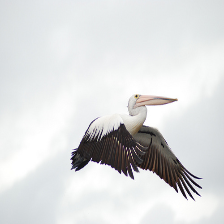
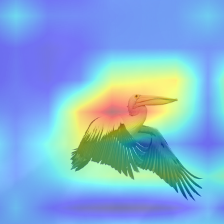
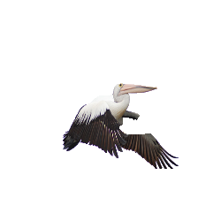

# Unofficial Implementation of GRAD CAM with Sanity Checks

In today's world, it’s very important that we should know on which part of the input our model is focusing while making its decision, especially when we are talking about self-driving cars or similar applications. There are some previous research works which claim to do this task one of them is 'Grad-CAM: Visual Explanations from Deep Networks via Gradient-based Localization' in this the authors proposed 2 techniques GRAD-CAM and Guided GRAD-CAM. GRAD-CAM is a technique that generates visual explanations for any CNN-based network without requiring architectural changes or re-training by using the gradient information flowing into the last convolutional layer of the CNN to assign importance values to each neuron for a particular decision of interest (i.e. for a given input class), while Guided GRAD-CAM which is the pointwise multiplication of the GRAD-CAM's output heatmap with Guided Backpropagation [Striving for Simplicity: The All Convolutional Net], to get visualizations which are both high-resolution and concept-specific, but then 'Sanity Checks for Saliency Maps', performed sanity checks on some of the approaches which produce saliency maps and showed that Guided Backpropagation didn't pass the checks and so as the Guided GRAD-CAM, while GRAD-CAM passes its checks.

### Example

        Input Image            |    GRAD-CAM Output Heatmap  |  Weakly-Supervised Task using GRAD-CAM output     
||  


---

### Files

File/notebooks with their description :
	
	**prepare_model.py**                              - It includes a function prepare_model_for_gradcam which will take features from the last spatial layer of CNN and make a forward and backward hood around it.
	**updated_utils.py**                              - It includes function get_saliency which will take model, refs, categories, model_imsize, last_spatial_layer as parameters and return a heatmap (output of grad-cam) while batch_overlay function will just blend input image and outputed heat map.
	**get_models.py**                                 - It has three functions, get_default_model which load the model with default weights, cascade_randomization function initialize last n layers randomly, independent_randomization initialize last n'th layer randomly
	**bird.jpg**                                      - It is the image of junco bird
	**GRAD-CAM-Sanity-Checks-For-Single-Image.ipynb** - Its like a driver notebook for GRAD-CAM with its sanity checks but just for a single image of 'junco bird'
	
Now instead of just a single image, I performed GRAD-CAM sanity checks on 50 random images. Because of memory issue, I couldn't do this for 50 images in a single notebook, so I splitted it into different notebooks:
	
	**Grad-CAM-Sanity-Checks-Get-50-Images.ipynb**                              - I used imagenet val data, so in this notebook, I just chose a synset randomly and then select and saved 50 images randomly corresponding to that synset.
	**Grad-CAM-Sanity-Checks-Original-Without-Randomization-50-Images.ipynb**   - outputed Grad-CAM heatmaps for the saved 50 random images and saved their results for the correlation and similarity test.
	**Grad-CAM-Sanity-Checks-Independent-Randomization-50-Images.ipynb**        - sanity check of Grad-CAM with last n'th layer (1 to 16) intialized randomly for 50 images and saved their results.
	**Grad-CAM-Sanity-Checks-Cascade-Randomization-50-Images.ipynb**            - sanity check of Grad-CAM with last n layers (1 to 16) intialized randomly for 50 images and saved their results.
	**Grad-CAM-Sanity-Checks-Correlation-50-Images.ipynb**                      - plotted correlation plot between the correlation of outputed heapmaps with diff randomized confriguation with original output heapmaps of GRAD-CAM, and I found that Grad-CAM passes the sanity checks as you can see the correlation plot decreases as we move from randomly initially last layers to initial ones....
	**Grad-CAM-Sanity-Checks-Weakly-Self-Supervised-50-Images.ipynb**           - evaluated the output of GRAD-CAM heatmaps for the weakly supervision task under different confriguation using Grabcut, and found that GRAD-CAM is doing a decent job. 


---

#### Repository Author   - Shubham Bindal
#### Email-id            - shubhambindal610@gmail.com (you may contact for any query) 

---

### References

```
@article{DBLP:journals/corr/SelvarajuDVCPB16,
  author    = {Ramprasaath R. Selvaraju and Abhishek Das and Ramakrishna Vedantam and Michael Cogswell and Devi Parikh and Dhruv Batra},
  title     = {Grad-CAM: Why did you say that? Visual Explanations from Deep Networks via Gradient-based Localization},
  journal   = {CoRR},
  volume    = {abs/1610.02391},
  year      = {2016},
  url       = {http://arxiv.org/abs/1610.02391},
}
```
```
@article{DBLP:journals/corr/abs-1810-03292,
  author    = {Julius Adebayo and Justin Gilmer and Michael Muelly and
               Ian J. Goodfellow and Moritz Hardt and Been Kim},
  title     = {Sanity Checks for Saliency Maps},
  journal   = {CoRR},
  volume    = {abs/1810.03292},
  year      = {2018},
  url       = {http://arxiv.org/abs/1810.03292},
}
```
